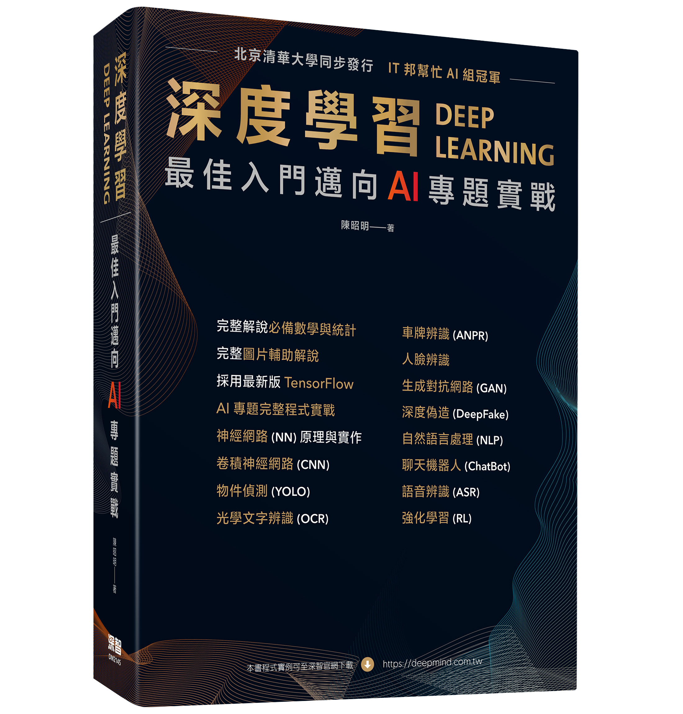

# 第15章	強化學習 Gym 套件v.2.6 大改版，現有程式會出現錯誤，請安裝 v2.4.1版
#### 請參閱 [v21 to v26 Migration Guide](https://gymnasium.farama.org/content/migration-guide/)
#### gym 不再更新，未來由 gymnasium 套件取代，請參閱 [Gymnasium GitHub](https://github.com/Farama-Foundation/Gymnasium)

# TensorFlow 變更
#### model.predict_classes 在 TensorFlow v2.5 已被淘汰, 應改為
```
np.argmax(model.predict(x_test_norm), axis=-1)
```

# 13_02_ChatterBot_test.ipynb 中的 ChatterBot 套件安裝在Windows作業系統安裝必須逐一套件安裝，例如：
```
pip install chatterbot --no-dependencies -U
pip install chatterbot_corpus
pip install pint
pip install mathparse
pip install pymongo -U
```
若出現 sqlalchemy 錯誤，dialect.has_table error, 請修改 anaconda3\Lib\site-packages\chatterbot\storage\sql_storage.py, 約在第46行。
```
        # Michael changed
        # if not self.engine.dialect.has_table(self.engine, 'Statement'):
        import sqlalchemy
        insp = sqlalchemy.inspect(self.engine)
        if not insp.has_table('Statement'):
```

# 深度學習 最佳入門邁向AI專題實戰



## 第一篇 深度學習導論
### 1	深度學習(Deep Learning)導論
##### 1.1	人工智慧的三波浪潮
##### 1.2	AI學習地圖
##### 1.3	機器學習應用領域
##### 1.4	機器學習開發流程
##### 1.5	開發環境安裝
### 2	神經網路(Neural Network)原理
##### 2.1	必備的數學與統計知識
##### 2.2	線性代數(Linear Algebra)
##### 2.3	微積分(Calculus)
##### 2.4	機率(Probability)與統計(Statistics)
##### 2.5	線性規劃(Linear Programming)
##### 2.6	最小平方法(OLS) vs. 最大概似法(MLE)
##### 2.7	神經網路(Neural Network)求解
## 第二篇 TensorFlow基礎篇
### 3	TensorFlow 架構與主要功能
##### 3.1	常用的深度學習套件
##### 3.2	TensorFlow 架構
##### 3.3	張量(Tensor)運算
##### 3.4	自動微分(Automatic Differentiation)
##### 3.5	神經層(Neural Network Layer)
### 4	神經網路的理解與實作
##### 4.1	撰寫第一支神經網路程式
##### 4.2	Keras模型種類
##### 4.3	神經層(Layer)
##### 4.4	激勵函數(Activation Functions)
##### 4.5	損失函數(Loss Functions) 
##### 4.6	優化器(Optimizers)
##### 4.7	效能衡量指標(Metrics)
##### 4.8	超參數調校(Hyperparameter Tuning) 
### 5	TensorFlow其他常用指令
##### 5.1	特徵轉換(One-hot encoding etc.)
##### 5.2	模型存檔與載入(Save and Load)
##### 5.3	模型彙總與結構圖(Summary and Plotting)
##### 5.4	回呼函數(Callbacks)
##### 5.5	工作記錄與視覺化(TensorBoard) 
##### 5.6	模型佈署(Deploy) 與 TensorFlow Serving
##### 5.7	TensorFlow Dataset
### 6	卷積神經網路(Convolutional Neural Network, CNN)
##### 6.1	卷積神經網路簡介
##### 6.2	卷積(Convolution) 
##### 6.3	各式卷積
##### 6.4	池化層(Pooling Layer)
##### 6.5	CNN模型實作
##### 6.6	影像資料增補(Data Augmentation)
##### 6.7	可解釋的AI(eXplainable AI, XAI)
### 7	預先訓練的模型(Pre-trained Model)
##### 7.1	預先訓練模型的簡介
##### 7.2	採用完整的模型
##### 7.3	採用部分的模型
##### 7.4	轉移學習(Transfer Learning)
##### 7.5	Batch Normalization層
## 第三篇 進階的影像應用
### 8	物件偵測(Object Detection)
##### 8.1	圖像辨識模型的發展
##### 8.2	滑動視窗(Sliding Window)
##### 8.3	方向梯度直方圖(HOG）
##### 8.4	R-CNN改良
##### 8.5	YOLO演算法簡介
##### 8.6	YOLO環境建置
##### 8.7	以TensorFlow使用YOLO模型
##### 8.8	YOLO模型訓練
##### 8.9	SSD演算法
##### 8.10	TensorFlow Object Detection API
##### 8.11	總結
### 9	進階的影像應用
##### 9.1	語義分割(Semantic Segmentation)介紹
##### 9.2	自動編碼器(AutoEncoder)
##### 9.3	語義分割(Semantic segmentation)實作
##### 9.4	實例分割(Instance Segmentation)
##### 9.5	風格轉換(Style Transfer) --人人都可以是畢卡索
##### 9.6	臉部辨識(Facial Recognition)
##### 9.7	光學文字辨識(OCR)
##### 9.8	車牌辨識(ANPR)
##### 9.9	卷積神經網路的缺點
### 10	生成對抗網路 (Generative Adversarial Network, GAN)
##### 10.1	生成對抗網路介紹
##### 10.2	生成對抗網路種類
##### 10.3	DCGAN
##### 10.4	Progressive GAN
##### 10.5	Conditional GAN
##### 10.6	Pix2Pix
##### 10.7	CycleGAN
##### 10.8	GAN挑戰
##### 10.9	深度偽造(Deepfake)
## 第四篇 自然語言處理
### 11	自然語言處理的介紹
##### 11.1	詞袋(BOW)與TF-IDF
##### 11.2	詞彙前置處理
##### 11.3	詞向量(Word2Vec)
##### 11.4	GloVe模型
##### 11.5	中文處理
##### 11.6	spaCy套件
### 12	第 12 章 自然語言處理的演算法
##### 12.1	循環神經網路(RNN)
##### 12.2	長短期記憶網路(LSTM)
##### 12.3	LSTM重要參數與多層LSTM
##### 12.4	Gate Recurrent Unit (GRU)
##### 12.5	股價預測
##### 12.6	注意力機制(Attention Mechanism)
##### 12.7	Transformer架構
##### 12.8	BERT
##### 12.9	Transformers套件
##### 12.10	總結
### 13	聊天機器人(ChatBot)
##### 13.1	ChatBot類別
##### 13.2	ChatBot設計
##### 13.3	ChatBot實作
##### 13.4	ChatBot工具套件
##### 13.5	Dialogflow實作
##### 13.6	結語
### 14	語音相關應用
##### 14.1	語音基本認識
##### 14.2	語音前置處理
##### 14.3	語音相關的深度學習應用
##### 14.4	自動語音辨識
##### 14.5	自動語音辨識實作
##### 14.6	結語
## 第五篇 強化學習 (Reinforcement learning)
### 15	強化學習 (Reinforcement learning)
##### 15.1	強化學習的基礎
##### 15.2	強化學習模型
##### 15.3	簡單的強化學習架構
##### 15.4	Gym套件
##### 15.5	Gym擴充功能
##### 15.6	動態規劃(Dynamic Programming)
##### 15.7	值循環(Value Iteration)
##### 15.8	蒙地卡羅(Monte Carlo)
##### 15.9	時序差分(Temporal Difference)
##### 15.10	其他演算法
##### 15.11	井字遊戲
##### 15.12	木棒台車(CartPole)
##### 15.13	結論

# 範例程式安裝說明
### 程式相關的測試資料過大，請至[這裡](https://drive.google.com/file/d/1ysZGVFZT2v21lazVo5exxs1aHG89LQRq/view?usp=sharing)下載
### 請解壓至 src 目錄下

# 各章參考資料：參考資料.pdf
